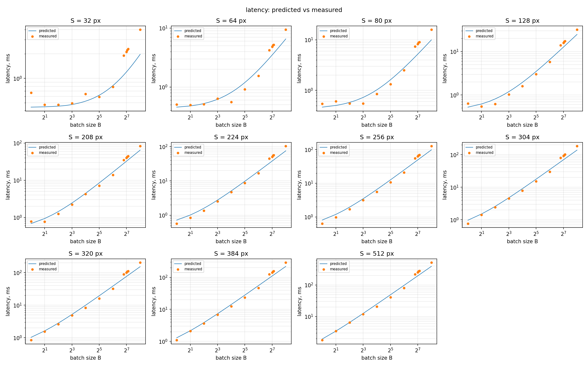
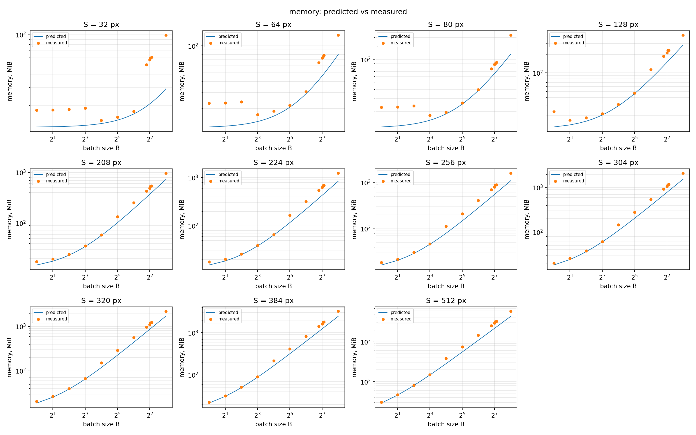
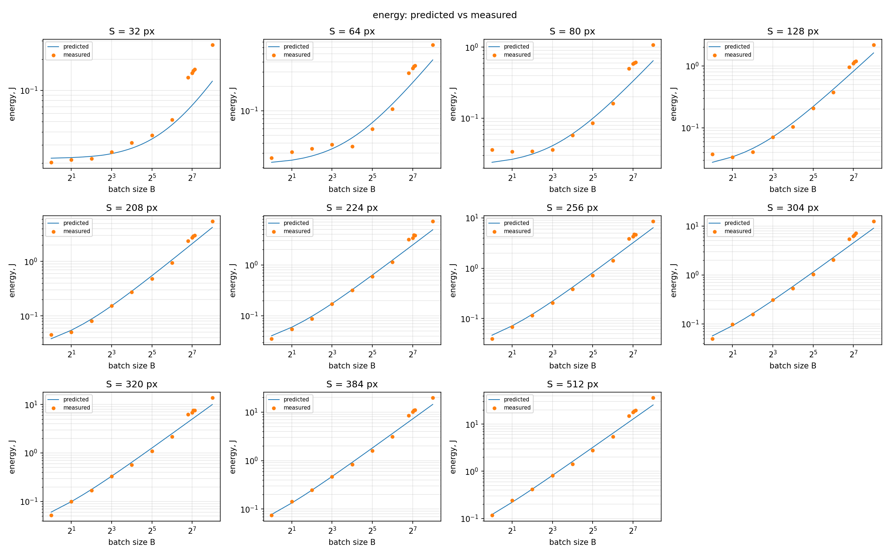

# HW1: analytical performance model of a small CNN

Derivations are in `hw1_handwritten.pdf`, the equations are in `equations.py`.

## Environment

Google Colab, Tesla T4 (14.56 GiB), driver 580.82.07, CUDA 12.8, cuDNN 9.19.0, PyTorch 2.11.0+cu128, Python 3.13.15. Full record in `results/env.json`.

## Reproduce

On Colab with a T4 runtime:

```
!git clone https://github.com/PE51K/itmo-ai-talent-hub-efficient-models-course.git repo
%cd repo/hw1
!pip install -q nvidia-ml-py
!python measure.py    # results/measurements.csv, results/env.json
!python calibrate.py  # results/theta.json
!python plots.py      # results/figures/*.png
```

## Results

θ is fitted on the base grid (63 configs), validation is the 69 configs with a random S or B.

| Parameter | Value |
|---|---|
| t_launch | 25.1 µs |
| P | 3.47 TFLOP/s |
| W | 320 GB/s (T4 datasheet, fixed) |
| e_F | 0 J/FLOP |
| e_M | 0.27 nJ/byte |
| P_static | 47.6 W |

| MAPE | Fit | Validation |
|---|---|---|
| Latency | 17.6 % | 22.3 % |
| Energy | 14.9 % | 23.1 % |
| Memory | 20.8 % | 24.7 % |

No OOM on the grid, and `memory()` predicts none either.




