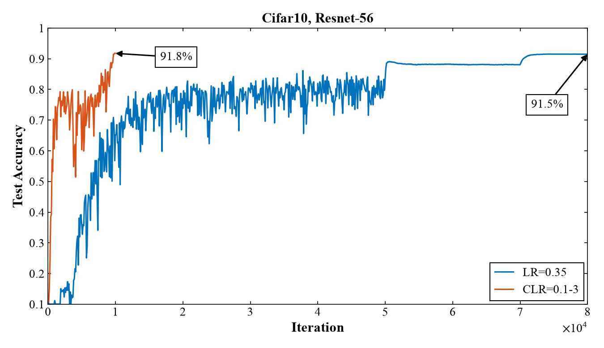
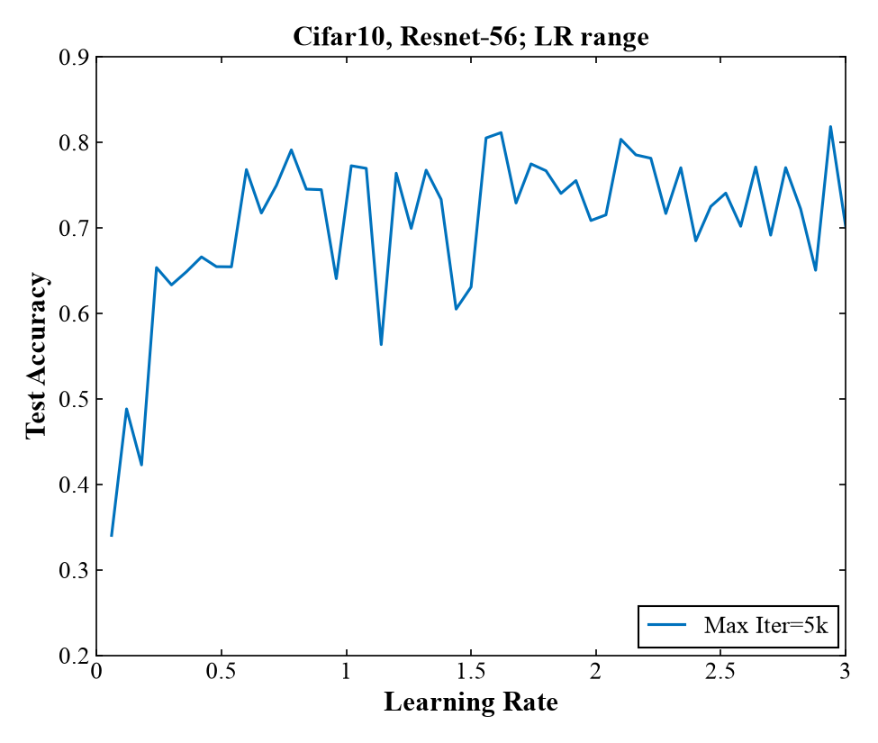
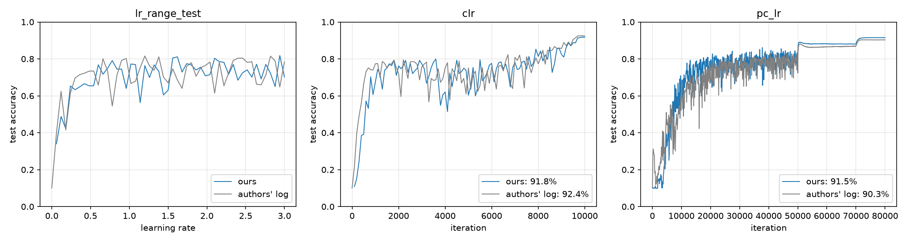

# HW2: reproducing super-convergence

Paper: Leslie N. Smith, Nicholay Topin, [Super-Convergence: Very Fast Training of Neural Networks Using Large Learning Rates](https://arxiv.org/abs/1708.07120), arXiv:1708.07120v3.

The [task](https://github.com/On-Point-RND/Efficient-Models-course-ITMO-2026/blob/main/home_work_two.md) asks for slides, a report and code:

- slides: [`slides.pdf`](slides.pdf), source in [`slides.tex`](slides.tex)
- report: this README
- code: [`models.py`](models.py), [`train.py`](train.py), [`plots.py`](plots.py), and the notebooks [`hw2_kaggle.ipynb`](hw2_kaggle.ipynb) (the run that produced `results/`) and [`hw2_colab.ipynb`](hw2_colab.ipynb)

## Paper

The paper shows that ResNet-56 on CIFAR-10 reaches higher test accuracy in 10,000 iterations with one cycle of a large learning rate than in 80,000 iterations of standard training. The authors call this super-convergence and explain it as follows: a large learning rate regularizes training, so other regularization (weight decay, dropout, small batches) has to be reduced to keep the total balanced. They also derive a learning rate estimate from a simplified Hessian-free method, and show that the gain from super-convergence grows as labeled data shrinks.

Terms:

- Iteration: one SGD update on a batch of 1000 images (8 GPUs x 125 in the paper). Run lengths and LR schedules are counted in iterations, 50 iterations are one epoch of 50,000 images.
- LR range test (Section 3): LR starts at 0 and grows linearly during a short run. Test accuracy vs LR shows which learning rates the network can still train with. If accuracy stays high at very large LRs, super-convergence is likely possible.
- CLR, cyclical learning rate (Section 3): LR goes linearly from a minimum to a maximum bound over `stepsize` iterations and back over the next `stepsize`, which makes one cycle. Caffe policy `triangular`.
- Super-convergence (Section 1): one CLR cycle up to a very large LR (3 here, typical LRs are about 0.1) reaches higher accuracy in far fewer iterations than typical training.
- PC-LR, piecewise constant learning rate (Section 2): the baseline. LR 0.35, divided by 10 at iterations 50,000 and 70,000. Caffe policy `multistep`.
- BN MAF (Table 1): Caffe's `moving_average_fraction`, the share of the old BN running mean and variance kept at each iteration. Test-time BN uses running stats. The paper uses 0.999 for PC-LR and 0.95 for the short CLR runs, because 0.999 follows the weights too slowly when training is fast.

## Experiments

ResNet-56 on CIFAR-10, the main result of the paper (Fig. 1a), the LR range test that motivates it (Fig. 2b), and the 10,000-sample rows of Table 1.

| Run | Paper | LR policy | Training samples | Iterations | BN MAF |
|---|---|---|---|---|---|
| `lr_range_test` | Fig. 2b, "Max Iter=5k" | LR 0 -> 3 linearly | 50,000 | 5,000 | 0.95 |
| `clr` | Fig. 1a | CLR 0.1-3, stepsize 5,000 | 50,000 | 10,000 | 0.95 |
| `pc_lr` | Fig. 1a | PC-LR 0.35 | 50,000 | 80,000 | 0.999 |
| `clr_10k` | Table 1, Fig. 4a | CLR 0.1-3, stepsize 5,000 | 10,000 | 10,000 | 0.95 |
| `pc_lr_10k` | Table 1, Fig. 4a | PC-LR 0.35 | 10,000 | 80,000 | 0.999 |

The official repo [lnsmith54/super-convergence](https://github.com/lnsmith54/super-convergence) has the Caffe solver and network files, `x.sh` with the changes for every figure, and the authors' training logs in `Results/`. The code follows these files and the Caffe version of the paper (October 2016, multi-GPU via P2PSync):

- Network: `Resnet56Cifar.prototxt`. The stem conv has stride 1 (Table 5 says 2). Downsampling shortcuts are 3x3/2 average pooling plus zero channels. Convs use msra init, the FC layer uses xavier. Convs have no bias, BN right after them cancels it.
- Batch norm: Caffe normalizes per GPU, so `CaffeBatchNorm2d` normalizes every 125 images of a batch with their own stats. Running stats come from the root GPU's 125 images, as a sum of batch stats weighted by MAF^age divided by the sum of weights.
- Data: Caffe reads the LMDB in the same order every epoch, without shuffling, and deals images to the GPUs round-robin, so GPU g gets images g, g + 8, ... of each 1000. The only augmentation is a random horizontal flip. Input is raw 0-255 pixels minus the mean image of all 50,000 training images. The 10k runs take the first 10,000 images, the paper doesn't say which.
- Solver: Caffe's SGD puts LR inside the momentum history (`history = 0.9 * history + lr * (grad + 1e-4 * w)`, `w -= history`), which `CaffeSGD` implements. Weight decay applies to every parameter, BN scale and shift included. The FC bias has `lr_mult` 2. `caffe_lr` is Caffe's `triangular` and `multistep` policies, it gives the same LR as every `lr =` line of the authors' logs.
- Test: every 100 iterations on 200 batches x 125 = 25,000 images. The test set has 10,000, so Caffe wraps around and continues from where the previous test stopped, and `TestBatches` does the same.
- FP32 with TF32 off.

`train.py` runs one process per GPU (1, 2, 4 or 8). Each process takes 8 / GPUs of the 125-image chunks of every batch, gradients are averaged over processes, and the BN running stats of the first process are used for tests. Random flips are drawn for the whole batch and split the same way. So 1, 2, 4 or 8 GPUs compute the same updates, up to the order of summation when gradients are averaged.

Environment: Kaggle, 2 x Tesla T4, CUDA 12.8, cuDNN 9.19, PyTorch 2.11.0, Lightning 2.6.6, Python 3.13.15, seed 0, one run per configuration. Config and environment of every run are in `results/<run>.json`.

## Results

| Run | Paper, % | Authors' log, % | Ours, % | Ours, best test, % | Time on 2 x T4, h |
|---|---|---|---|---|---|
| `clr` | 92.4 | 92.4 | 91.8 | 91.8 | 0.92 |
| `pc_lr` | 91.2 | 90.3 | 91.5 | 91.5 | 7.40 |
| `clr_10k` | 80.6 | 80.6 | not run | | |
| `pc_lr_10k` | 71.4 | 71.2 | not run | | |

Final test accuracy after the last iteration. "Authors' log" is the last test in the `Results/` logs of the official repo. The 10k runs are version 2 of the Kaggle notebook and haven't been run yet.



Fig. 1a reproduced. CLR reaches 91.8 % after 10,000 iterations, PC-LR reaches 91.5 % after 80,000. PC-LR first gets to 90 % at iteration 70,500, after the second LR drop, and never reaches CLR's final accuracy. Super-convergence gives the same accuracy as typical training with 8 times fewer iterations: 0.92 h instead of 7.40 h.



Fig. 2b reproduced, the 5k curve. Test accuracy climbs to 0.65 by LR 0.25 and stays at 0.7-0.8 all the way to LR 3, without the peak and drop of a typical range test. Mean test accuracy is 0.73 for LR 0.5-1 and 0.74 for LR 2-3. This is the behavior the paper takes as a sign that super-convergence is possible.



Our curves next to the authors' Caffe logs of the same runs. They follow each other within the test-to-test noise. CLR ends 0.6 points below the paper and the log. PC-LR ends 0.3 points above the paper and 1.2 above the log. The authors' own PC-LR log ends 0.9 points below their paper, so differences of this size show up between runs of the same setup, and we have one run per configuration.

## Discussion

The main claim holds: one LR cycle up to 3 trains ResNet-56 to the accuracy of 80,000-iteration PC-LR in 10,000 iterations. The LR range test shows why: the network keeps training at LRs 10-30 times larger than usual, so a short schedule can spend most of its iterations at large LRs.

In the CLR run, test accuracy jumps between 0.5 and 0.85 while LR is above 1 and grows from 0.81 to 0.92 in the last 2,000 iterations, when LR goes back down to 0.1. Both runs end at 100 % training accuracy and within 0.3 points of each other on test, so on 50,000 samples the gain is in iterations, not in final accuracy. The paper's Table 1 says the gap grows as the training set shrinks, which the 10k runs would check.

Not reproduced, for lack of GPU time:

- Fig. 1b: CLR with other stepsizes.
- Fig. 2b: the 20k and 100k range tests.
- Fig. 5: the learning rate estimate from Section 4.
- Table 1: the rows with 20,000-40,000 samples.
- Section 5: other datasets, architectures and batch sizes, and the regularization experiments.

## Reproduce

Open [`hw2_kaggle.ipynb`](https://kaggle.com/kernels/welcome?src=https://github.com/PE51K/itmo-ai-talent-hub-efficient-models-course/blob/main/hw2/hw2_kaggle.ipynb) in Kaggle with GPU T4 x2 and internet on, and save a version with `VERSION = 1` (`lr_range_test`, `clr`, `pc_lr`, about 9 h) and one with `VERSION = 2` (`clr_10k`, `pc_lr_10k`). Output goes to `/kaggle/working/results`.

[`hw2_colab.ipynb`](https://colab.research.google.com/github/PE51K/itmo-ai-talent-hub-efficient-models-course/blob/main/hw2/hw2_colab.ipynb) runs the same code on one T4. A run there takes about twice as long. PC-LR runs don't fit in Colab's 12-hour session, `--max-hours 11.5` stops them early.

Locally:

```
uv run python train.py lr_range_test clr pc_lr
uv run python plots.py
```

`train.py` writes `results/<run>.csv` (one row per test) and `results/<run>.json` (config and environment). `plots.py` writes `results/figures/` and prints final accuracies next to the paper's and the authors' logs.
